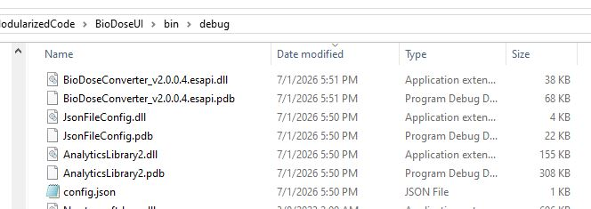
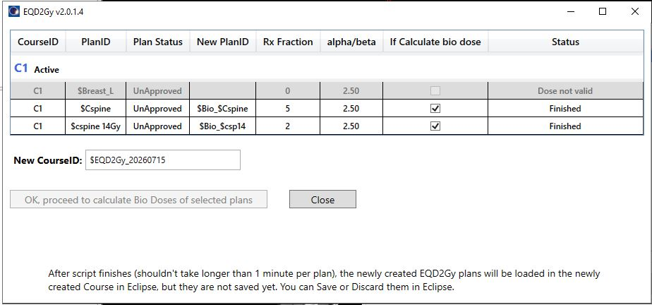
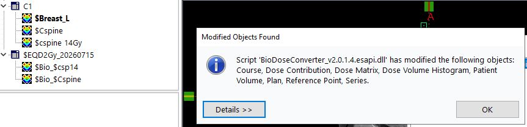

# BioDoseConverter for Biologically Equivalent Doses
# Disclaimer 
THE SOFTWARE DESIGNER AND PROVIDER, INCLUDING ANY COLLABORATING INSTITUTION(S), INCLUDING THE UNIVERSITY OF MICHIGAN, SHALL HAVE NO LIABILITY TO ANY PATIENT OR ANY OTHER PERSON. NO SUCH PERSON OR ENTITY ASSUMES ANY LEGAL LIABILITY OR RESPONSIBILITY FOR THE ACCURACY, COMPLETENESS, SUITABILITY, OR USEFULNESS OF BIODOSECONVERTER OR RELATED INFORMATION. ANY AND ALL LIABILITY ARISING DIRECTLY OR INDIRECTLY FROM THE USE OF THIS APPLICATION IS HEREBY DISCLAIMED. 
THIS SOFTWARE IS INTENDED FOR INFORMATIONAL/RESEARCH PURPOSES ONLY AND MUST BE USED IN CONJUNCTION WITH EXPERT CLINICAL GUIDANCE. IT SHOULD NOT BE RELIED UPON SOLELY FOR ANY CLINICAL, OPERATIONAL, DIAGNOSTIC, OR CARE-RELATED DECISIONS. 
THE INFORMATION AND SOFTWARE HEREIN ARE PROVIDED "AS IS" AND WITHOUT ANY WARRANTY EXPRESSED OR IMPLIED, INCLUDING, BUT NOT LIMITED TO, THE IMPLIED WARRANTIES OF MERCHANTABILITY AND FITNESS FOR A PARTICULAR PURPOSE.

# About
BioDoseConverter is an Eclipse writable binary plugin script. It takes existing plans with physical doses and converts their physical doses into EQD2Gy doses. A new Course with plans will be created to hold converted EQD2Gy doses.

# How to Deploy

You do NOT need Eclipse thick client (where Varian Eclipse is locally installed) to compile this script plugin.

After cloning and successfully building the project `./BioDoseUI.csproj` (with x64 configuration). You will see in its bin folder:

    

 

Copy this `bin/debug` folder, rename it if desired, to a location where your Eclipse system can access. This script `BioDoseConverter_vx.x.x.x.esapi.dll` runs as a binary script plugin. In Eclipse External Beam Planning > Tools > Scripts:

    

 

Locate the deployment folder containing the above `BioDoseConverter_vx.x.x.x.esapi.dll` file. Double-click or select it and click the 'Run' button:

    

 

# User Guide

After successfully starting the script, you will see the following window (please open some treatment plan in Eclipse before running the script):

    

 

- **New PlanID** and **alpha/beta** columns can be changed for each individual plan.
- Whether a plan will be converted can be toggled with the checkbox under **If Calculate bio dose**
- Plans with invalid doses will be grayed out and excluded from bio dose calculation.
- Newly created EQD2Gy plan(s) will have the same number of fractions from the source physical dose plan.
- A new course with specified **New CourseID** will be created to hold generated plans with EQD2Gy dose.

After adjusting New PlanID and alpha/beta, click the OK button. When the script finishes, the newly created EQD2Gy course and plans will be loaded in Eclipse. You can later save or discard these changes with the Eclipse UI.

    

 

    

 