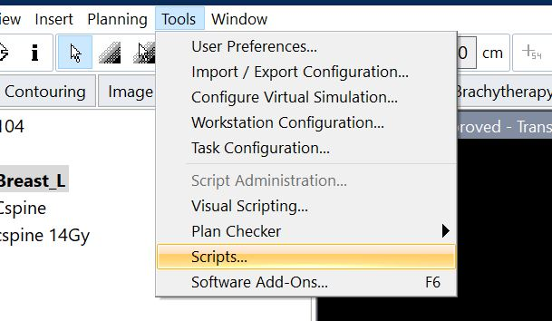
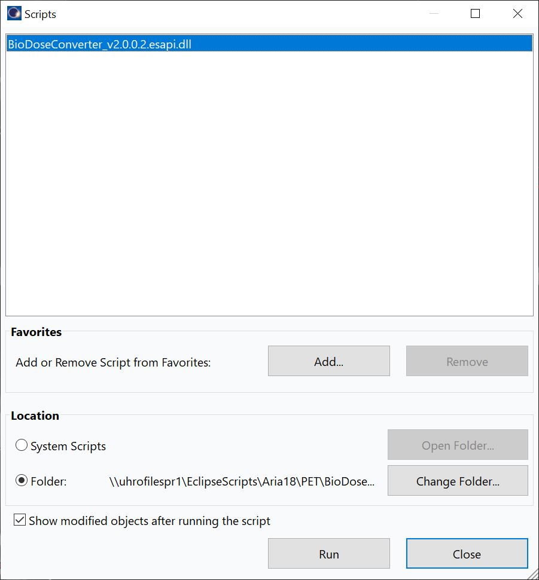
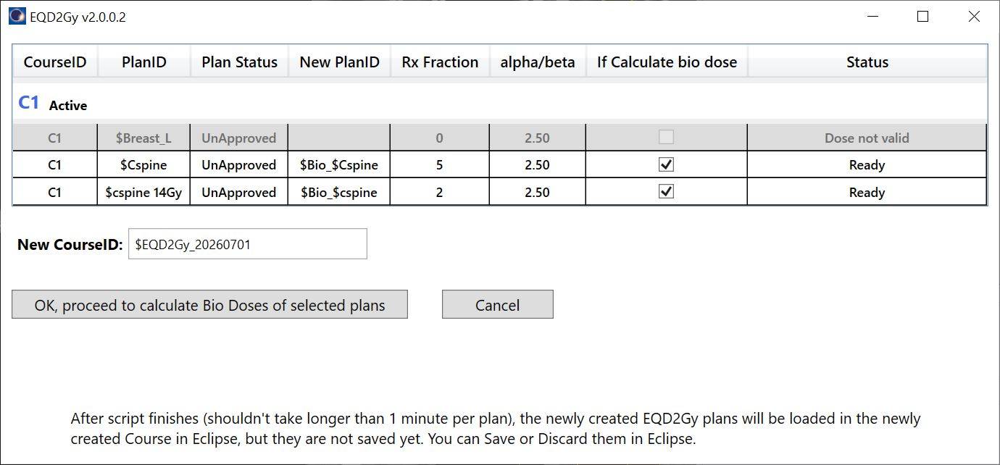

# BioDoseConverter for Biologically Equivalent Doses
# Disclaimer 
THE SOFTWARE DESIGNER AND PROVIDER, INCLUDING ANY COLLABORATING INSTITUTION(S), INCLUDING THE UNIVERSITY OF MICHIGAN, SHALL HAVE NO LIABILITY TO ANY PATIENT OR ANY OTHER PERSON. NO SUCH PERSON OR ENTITY ASSUMES ANY LEGAL LIABILITY OR RESPONSIBILITY FOR THE ACCURACY, COMPLETENESS, SUITABILITY, OR USEFULNESS OF BIODOSECONVERTER OR RELATED INFORMATION. ANY AND ALL LIABILITY ARISING DIRECTLY OR INDIRECTLY FROM THE USE OF THIS APPLICATION IS HEREBY DISCLAIMED. 
THIS SOFTWARE IS INTENDED FOR INFORMATIONAL/RESEARCH PURPOSES ONLY AND MUST BE USED IN CONJUNCTION WITH EXPERT CLINICAL GUIDANCE. IT SHOULD NOT BE RELIED UPON SOLELY FOR ANY CLINICAL, OPERATIONAL, DIAGNOSTIC, OR CARE-RELATED DECISIONS. 
THE INFORMATION AND SOFTWARE HEREIN ARE PROVIDED "AS IS" AND WITHOUT ANY WARRANTY EXPRESSED OR IMPLIED, INCLUDING, BUT NOT LIMITED TO, THE IMPLIED WARRANTIES OF MERCHANTABILITY AND FITNESS FOR A PARTICULAR PURPOSE.

# About
The application is an Eclipse binary plugin script, which takes existing plans and convert their physical doses into EQD2Gy doses, and place EQD2Gy dose in newly created course and plans.

# How to Deploy
After download and successfully build the project (with x64 configuration), this program runs as an Eclipse binary script plugin:

    

 

    

 

    

 
